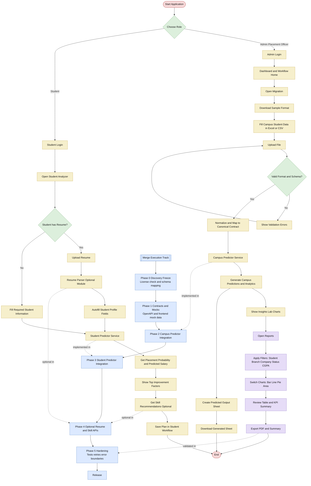

# Placify Merge Flowchart - Full Version

Use this diagram as the canonical visual plan for implementation and team alignment.

## Notes
- This diagram is planning-focused and based on our merge plan.
- Optional modules are marked as optional.
- Do not directly copy donor repo files without confirming license and attribution requirements.
